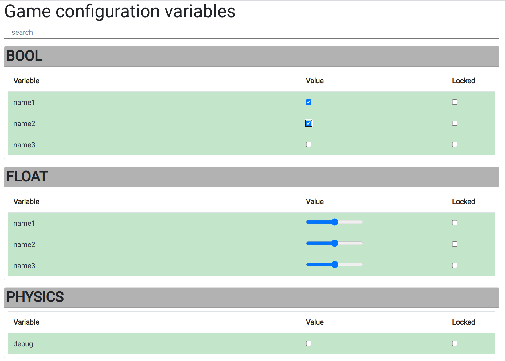

# tuna-web

Web frontend for the Tuna CVAR tool to allow browser access to variables.



``` rust
fn main() {
    let mut server = tuna_web::TunaServer::new(4450).unwrap();

    /* Set up variables etc */

    loop {
        server.loop_once(); // will handle all pollable connections - individual clients will run on threads

        /* Other logic */
    }
}
```

Note that `tuna-web` is a work in progress! I'm working on it due to a need, but
I want to dogfood it while I build it - not build a whole thing on its own.

## Alternatives:

* [const-tweaker](https://crates.io/crates/const-tweaker) - similar in workflow to tuna + tuna-web, unfortunately suffers from soundness issues.
